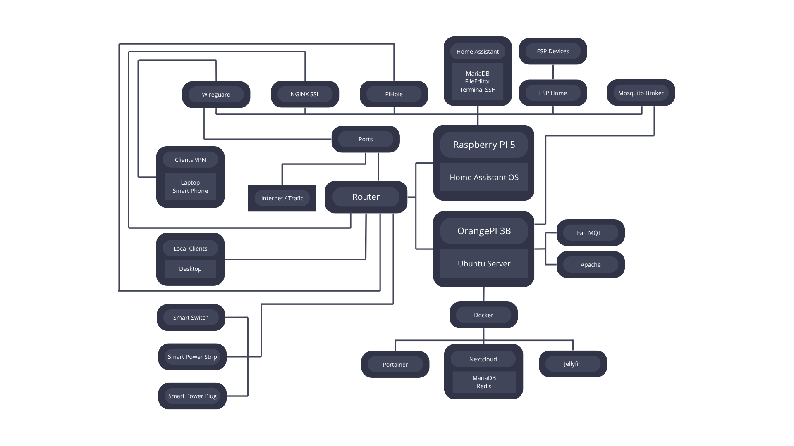
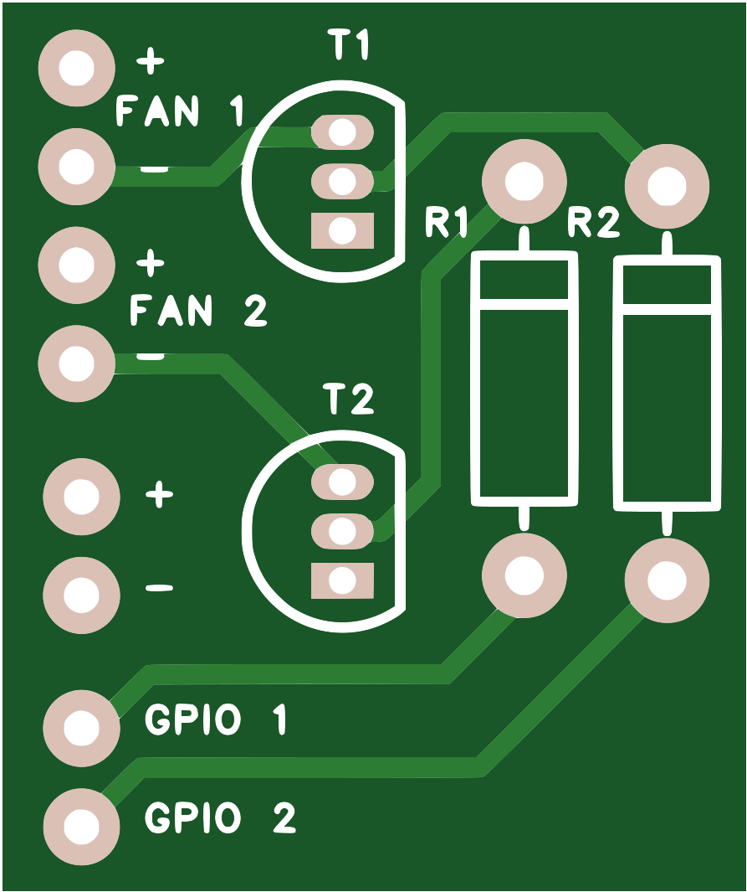
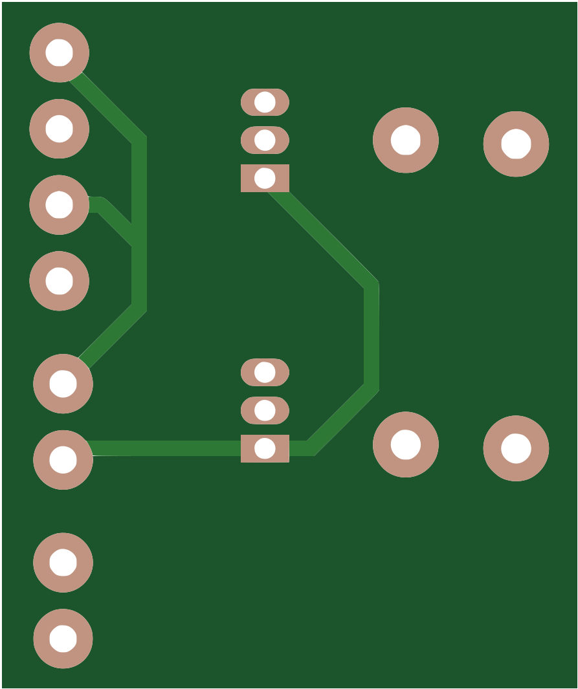

<!-- HERO -->

# Home Lab

**Self-hosted  homelab on Raspberry Pi and Orange Pi.**

 

 

## ✨ What is this?

A small self-hosted homelab built with a Raspberry Pi 5 and an Orange Pi 3B, running Home Assistant, Docker services, MQTT, Pi-hole and WireGuard.

## 🧱 The stack
### Raspberry Pi 5

- **Home Assistant OS**

- Home automation, networking and device management.

- 8 GB RAM · 512 GB SSD

| Service | Role |
| :--- | :--- |
| **Home Assistant** | Automation & state engine |
| **Mosquitto** | MQTT broker |
| **ESPHome** | ESP device integration |
| **Pi-hole** | Network-wide DNS filtering |
| **WireGuard** | VPN & remote access |

---

### Orange Pi 3B

- **Ubuntu Server**

- Secondary server for fan control and containerized services.

- 8 GB RAM · 512 GB SSD

| Service | Role |
| :--- | :--- |
| **Fan Control** | MQTT-based fan control script |
| **Portainer** | Docker container management |
| **Nextcloud** | Self-hosted files, calendar & contacts |
| **Jellyfin** | Self-hosted media server |
| **MariaDB** | Database |
| **Redis** | Cache & data store |

## 🗺️ How it connects

## 💡 Devices

| | Device | Location | Link | Role |
|:-:|:--|:--|:--|:--|
| 💡 | Double Smart Switch | Bedroom Lights | Tuya Wifi | On/Off |
| 💡 | Smart Leds | Desktop Leds | Tuya/Wifi | On/Off, RGBW |
| 🔌 | Smart Plug | Additional Power | Tuya/Wifi | On/Off |
| 🔌 | Smart Power Strip | Desktop Power | Tuya/Wifi | On/Off |
| 🖥️ | Desktop PC  | Desktop | MQTT | On/Off, Commands |

## ⚙️ Most Important Automations

- **GPS Shutdown Desktop PC** — Triggers an MQTT shutdown of the PC and associated smart plugs based on mobile GPS presence, with action notification.
- **Orange Pi Fan Control** - Publishes temperature data via MQTT; Home Assistant controls two fans based on temperature thresholds.
## 💵 Cost

<table width="80%">
  <thead>
    <tr>
      <th>Category</th>
      <th>Component</th>
      <th>Cost</th>
    </tr>
  </thead>
  <tbody>
    <tr>
      <td rowspan="2"><b>Hardware</b></td>
      <td>Raspberry Pi 5 (8 GB)</td>
      <td>117.00 €</td>
    </tr>
    <tr>
      <td>Orange Pi 3B (8 GB)</td>
      <td>56.39 €</td>
    </tr>
    <tr>
      <td rowspan="5"><b>Power & Cooling</b></td>
      <td>Raspberry Pi Power Supply</td>
      <td>15.47 €</td>
    </tr>
    <tr>
      <td>Orange Pi Power Supply ×2</td>
      <td>20.78 €</td>
    </tr>
    <tr>
      <td>SSD Heatsinks ×2</td>
      <td>11.98 €</td>
    </tr>
    <tr>
      <td>5v Fans ×2</td>
      <td>2.98 €</td>
    </tr>
    <tr>
      <td>UPS</td>
      <td>41.99 €</td>
    </tr>
    <tr>
      <td rowspan="6"><b>Storage & Accessories</b></td>
      <td>Raspberry Pi SSD (512 GB)</td>
      <td>Reused</td>
    </tr>
    <tr>
      <td>Orange Pi SSD (512 GB)</td>
      <td>Reused</td>
    </tr>
    <tr>
      <td>PCIe M.2 Adapter</td>
      <td>16.00 €</td>
    </tr>
    <tr>
      <td>Self Made Control Fan PCB</td>
      <td>3.00 €</td>
    </tr>
    <tr>
      <td>Raspberry Pi Case</td>
      <td>12.96 €</td>
    </tr>
    <tr>
      <td>Orange Pi Case</td>
      <td>9.83 €</td>
    </tr>
    <tr>
      <td colspan="2"><b>Total</b></td>
      <td><b>307.38 €</b></td>
    </tr>
  </tbody>
</table>

## Explanations

# Orange Pi 3B

The Orange Pi 3B runs several services managed with Docker and integrates with Home Assistant through MQTT.

## 🌀 Fan Control

A Python script controls two GPIO fans and publishes system telemetry via MQTT.

* Fans are enabled at startup and controlled through MQTT commands.
* Publishes CPU/NVMe temperature, CPU/RAM usage, disk usage and uptime every 5 seconds.
* Reports `Online` / `Offline` availability status.
* Supports remote reboot via MQTT.
* Fan temperature thresholds are configured in Home Assistant.

**Requirements:** Python 3, `paho-mqtt`, `psutil` and root privileges for GPIO access.

## 🌀 Fan PCB

The custom PCB uses two **2N2222 NPN transistors** to control two **5V fans**.
- `GPIO 1` controls **Fan 1** through `T1`.
- `GPIO 2` controls **Fan 2** through `T2`.
- The 2N2222 transistors act as switches, allowing the Orange Pi to turn each fan on or off without powering them directly from the GPIO pins.

<table width="100%">
  <tr>
    <td align="center" width="50%">
      
       
      Top Layer
    </td>
    <td align="center" width="50%">
      
       
      Bottom layer
    </td>
  </tr>
</table>

## 🐳 Docker Services

All services are defined in a single Docker Compose file and configured to restart automatically.

| Service       | Description                                    | Port                       |
| ------------- | ---------------------------------------------- | -------------------------- |
| **Jellyfin**  | Self-hosted media server                       | `8096` HTTP                |
| **Portainer** | Docker management interface                    | `9443` HTTPS               |
| **Nextcloud** | Private cloud for files, calendar and contacts | `8080` HTTP / `8443` HTTPS |

### Storage & Network

* Jellyfin libraries and configuration are stored on the Orange Pi SSD.
* Nextcloud data and Portainer settings use persistent Docker volumes.
* Nextcloud and MariaDB communicate through a dedicated Docker network.
* Nextcloud HTTPS uses a self-signed certificate for encrypted local-network access.

 

  

    Licensed under the <b>MIT License</b> · <a href="LICENSE">View license</a>
  

